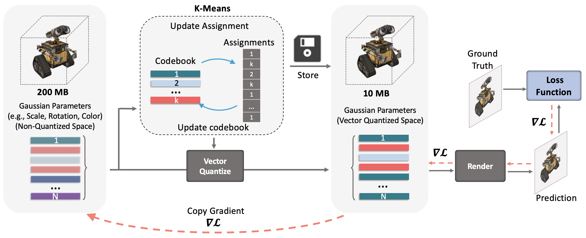

# CompGS: Smaller and Faster Gaussian Splatting with Vector Quantization [ECCV 2024]

This Repository is an official implementation of "[CompGS: Smaller and Faster Gaussian Splatting with Vector Quantization](https://arxiv.org/abs/2311.18159)". The paper has been accepted at ECCV 2024. 

[[Overview]](#overview) [[Updates]](#updates) [[Getting Started]](#getting-started) [[Training]](#training) [[Rendering and Evaluation]](#rendering-and-evaluation) [[Pre-trained Models]](#pre-trained-models) [[Visualization]](#convert-quantized-model-to-non-quantized-for-visualization)

## Overview



Compact3D is a method to reduce the storage memory requirements of [3D Gaussian Splatting](https://repo-sam.inria.fr/fungraph/3d-gaussian-splatting/) models. 3D Gaussian Splatting is a new technique for novel view synthesis where properties of 3D Gaussians (location, shape, color) are optimized to model a 3D scene. The method performs better than SOTA NeRF approaches, is extremely fast to train and can be rendered in real time during inference. However, since a typical scene requires millions of Gaussians to model it, the memory requirements can be an order of magnitude more than many NeRF approaches. Here, we reduce the size of the trained 3D Gaussian Splat models by 10-20x by vector quantizing the Gaussian parameters. An overview of our method is shown below. We perform K-Means quantization on the covariance and color parameters of all Gaussians and replace values of each with the corresponding entry in the codebook (i.e., the cluster center). This is done in conjuncion with the training of the parameter values as done in the non-quantized version of Gaussian splatting. We observe that the models can be compressed 20 times without a big drop in performance. 

## Updates
**[31 July 2024]:** Added code for opacity regularization. The opacity values of Gaussians are regularized and highly transparent Gaussians are pruned. The 'opacity_reg' argument is set by default in the ``run.sh`` script. Remove it from the arguments list to disable regularization (and end up with a lot more Gaussians than needed!).

**[30 June 2024]:** Added [pre-trained models](https://drive.google.com/drive/folders/1t3w_hjJlkX3Zxa8Wh0OKhlvbAHY02GB0?usp=sharing) with opacity regularization. Regularization encourages the Gaussians to be transparent and the highly transparent ones are regularly pruned, resulting in a model with fewer number of Gaussians. This results in further 4-5x compression (total 40-50x!) along with 2-3x speed-up in rendering. 

**[25 June 2024]:** You can convert our quantized model to a non-quantized ply file. This can be used for visualization of the trained model using 3D Gaussian Splat viewers.  

**[16 February 2024]:** Trained models are now available [here](https://drive.google.com/drive/folders/14WVjkqmkhbJQ-IEM_Un0YTTiB2jKJqQD?usp=sharing). Models are available for MipNerf-360, Tanks and Temples and DeepBlending dataset for both CompGS-4k and CompGS-32k variants. 

**[4 January 2024]:** We have updated the code to store and load the quantized parameters using the indices and codebook. Only the compressed version of the model is saved.  

## Getting Started 

Our code is based on the excellent official repo for [3D Gaussian Splatting](https://github.com/graphdeco-inria/gaussian-splatting/tree/main). First, clone our repository. 
```shell
git clone https://github.com/UCDvision/compact3d
cd compact3d
```
Then, follow the instructions [here](https://github.com/graphdeco-inria/gaussian-splatting/tree/main) to clone and install 3D Gaussian Splatting. Additionally, install the ``bitarray`` package to efficiently store the kmeans indices. 
```shell
pip install bitarray
```
You should now have a directory named ```gaussian-splatting``` in the ```compact3d``` folder. Next, move the downloaded files from our repo to the appropriate locations in the gaussian-splatting folder.
```shell
bash move_files_to_gsplat.sh
```

## Training

Modify the paths to dataset and output folder in the ```run.sh``` script. To reduce the training time, you can reduce ```kmeans_iters``` (say from 10 to 5) and increase the ```kmeans_freq``` value (e.g. to 200). This will have minor reduction in performance but can reduce training time by 30%-50%. 
```shell
cd gaussian-splatting
bash run.sh
```

## Rendering and Evaluation

Once the model is trained, the rendering and evaluation process is exactly the same as in 3D Gaussian Splatting. Following their instructions,
```shell
python render.py -m <path to trained model> --skip_train --load_quant # Generate renderings
python metrics.py -m <path to trained model> # Compute error metrics on renderings
```
Use the ```skip_train``` argument to avoid rendering the images from the train set camera viewpoints and the ```load_quant``` argument when loading our quantized model. Remove the ```load_quant``` argument if evaluating the original non-qunatized model.  

## Pre-trained Models
Trained models are now available [here](https://drive.google.com/drive/folders/14WVjkqmkhbJQ-IEM_Un0YTTiB2jKJqQD?usp=sharing). Models are available for MipNerf-360, Tanks and Temples and DeepBlending dataset for both CompGS-4k and CompGS-32k variants both with and w/o opacity regularization. You can download these models and provide the paths in the render and evaluation codes to get the metrics. The metrics might not exactly match those in the paper since these are re-runs with different seeds.

## Convert quantized model to non-quantized for visualization
It is not possible to directly use standard 3D Gaussian Splat viewers to view our quantized models. You can use the decompression code to convert them to a ply file and then use any off-the-shelf viewer for 3DGS. The following code saves a file named point_cloud_decompressed.ply in the project save path.  
```shell
python decompress_to_ply.py -m <path to trained model> 
```

## Citation

If you make use of the code, please cite the following work:
```
@article{navaneet2023compact3d,
  title={CompGS: Smaller and Faster Gaussian Splatting with Vector Quantization},
  author={Navaneet, KL and Meibodi, Kossar Pourahmadi and Koohpayegani, Soroush Abbasi and Pirsiavash, Hamed},
  journal={ECCV},
  year={2024}
}
```

## License

This project is under the MIT license.
